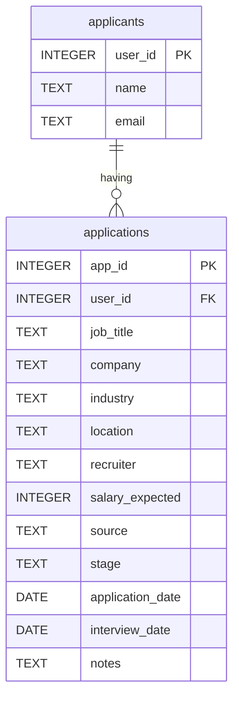

# Experiment and Explore for Silver Layer Setup

This is a write-up for this silver layer, showing my thought process as I go.

> This is a md version of the `.dbcnb` file because github does not render it similar to `.ipynb` files. Hence, the markdown file.


```sql
SELECT *
FROM bronze_job_applications
LIMIT 10;
```

| application_id | applicant_name | email | company | industry | job_title | location | source | application_date | stage | salary_expected | recruiter | interview_date | notes |
| :--- | :--- | :--- | :--- | :--- | :--- | :--- | :--- | :--- | :--- | :--- | :--- | :--- | :--- |
| 1 | Jamie Santos | jamie.santos@example.com | FoodHub PH | Food | Backend Developer | Manila | Kalibrr | 13/07/2026 | Applied | 45000 | Ana Santos | null | null |
| 2 | Cameron Dela Cruz | cameron.delacruz@example.com | GreenCart PH | E-commerce | Software Engineer | Quezon City | Referral | 13/01/2026 | Applied | 45000 | Nina Tan | null | Follow up next week |
| 3 | Jordan Dela Cruz | jordan.delacruz@example.com | DataBridge Analytics | Technology | Data Analyst | Taguig | JobStreet | 02/03/2026 | Screening | 50000 | Ken Flores | 18/03/2026 | Need to prepare SQL |
| 4 | Taylor Garcia | taylor.garcia@example.com | HealthFirst Labs | Healthcare | Python Developer | Pasig | LinkedIn | 19/07/2026 | Screening | 35000 | Julia Cruz | 18/08/2026 | Need to prepare SQL |
| 5 | Casey Santos | casey.santos@example.com | BuildRight | Construction | Python Developer | Pasig | LinkedIn | 10/07/2026 | Screening | 35000 | Nina Tan | 22/07/2026 | Need to prepare SQL |
| 6 | Jordan Reyes | jordan.reyes@example.com | BuildRight | Construction | Data Engineer | Pasig | JobStreet | 16/01/2026 | Final Interview | 50000 | Ana Santos | 31/01/2026 | Resume submitted |
| 7 | Morgan Cruz | morgan.cruz@example.com | EduSphere | Education | Data Engineer | quezon city | Referral | 09/04/2026 | Screening | 50000 | Ken Flores | 17/04/2026 | null |
| 8 | Jordan Cruz | jordan.cruz@example.com | SecureNet | Technology | Software Engineer | Makati | Kalibrr | 03/05/2026 | Screening | 80000 | Julia Cruz | 01/06/2026 | Follow up next week |
| 9 | Alex Flores | alex.flores@example.com | BRIGHTBANK | Finance | QA Engineer | Makati | JobStreet | 17/04/2026 | Applied | 45000 | Ken Flores | null | Strong culture fit |
| 10 | Riley Cruz | riley.cruz@example.com | LogiFast | Logistics | Business Analyst | Cebu City | Kalibrr | 13/03/2026 | Applied | 80000 | Nina Tan | null | No response yet |

## Row Count

```sql
SELECT COUNT(*) as row_count
FROM bronze_job_applications;
```

## Missing Check

```sql
SELECT
    COUNT(*) - COUNT(applicant_name) as applicant_name_count,
    COUNT(*) - COUNT(application_id) as application_id_count,
    COUNT(*) - COUNT(application_date) as application_date_count,
    COUNT(*) - COUNT(company) as company_count,
    COUNT(*) - COUNT(email) as email_count,
    COUNT(*) - COUNT(industry) as industry_count,
    COUNT(*) - COUNT(interview_date) as interview_date_count,
    COUNT(*) - COUNT(job_title) as job_title_count,
    COUNT(*) - COUNT(location) as location_count,
    COUNT(*) - COUNT(salary_expected) as salary_expected_count,
    COUNT(*) - COUNT(source) as source_count,
    COUNT(*) - COUNT(stage) as stage_count,
    COUNT(*) - COUNT(recruiter) as recruiter_count
FROM bronze_job_applications;
```

The table yields a few missing on columns:

- `application_date_count` : 3
- `interview_date_count` : 37
- `salary_expected_count` : 5
- `recruiter_count` : 6

> *Note to future self: The current query is **not scalable**. Try to find or research about optimized null counts query*

```sql
SELECT 
    s.attname AS column_name,
    ROUND((s.null_frac * c.reltuples)::numeric) AS estimated_null_count,
    ROUND((s.null_frac * 100)::numeric, 2) AS null_percentage
FROM pg_stats s
JOIN pg_class c ON c.relname = s.tablename
JOIN pg_namespace n ON n.oid = c.relnamespace AND n.nspname = s.schemaname
WHERE s.tablename = 'bronze_job_applications' 
  AND s.schemaname = 'public';
```

| column_name | estimated_null_count | null_percentage |
| :--- | :--- | :--- |
| application_id | 0 | 0.00 |
| applicant_name | 0 | 0.00 |
| email | 0 | 0.00 |
| company | 0 | 0.00 |
| industry | 0 | 0.00 |
| job_title | 0 | 0.00 |
| location | 0 | 0.00 |
| source | 0 | 0.00 |
| application_date | 3 | 3.75 |
| stage | 0 | 0.00 |
| salary_expected | 5 | 6.25 |
| recruiter | 6 | 7.50 |
| interview_date | 37 | 46.25 |
| notes | 9 | 11.25 |

> *Note to self: This query yields the same result as the count query. Use this kind of query later on to optimize the null checks.*

The query above looks at the metadata of the table and not bruteforcing your way to count the missing values!

We could just remove this one, but we try to save the columns as much as possible (assuming this will be a thousand records, such data would be a waste)

Let's try to understand if the missing data is truly missing.

- `Application date` have unexpected missing data. One reason that comes in mind is that, It may be because the fictional user forgot to add it. a `null` value could mean the applicant does not remember the applied date on that application
- `interview date` is acceptable because the application might be still on applied state. a `null` value could mean the applicant is not expecting interview on that application yet (applied stage)
- `salary` is also acceptable because job posting have undisclosed salary. a `null` value could mean it is undisclosed
- `recruiter` is where the real argument starts. Just a reminder, this is a job application tracker, and not a job posting site data, so the user might not know the recruiter of a given company (since job posting may or may not have a visible recruiter). Since this is a string, an `unknown` fill is applied to this table also

## Fix table Datatypes

```sql
SELECT column_name, data_type
FROM information_schema.columns
WHERE table_name = 'bronze_job_applications'
ORDER BY column_name;
```

| column_name | data_type |
| :--- | :--- |
| applicant_name | text |
| application_date | text |
| application_id | bigint |
| company | text |
| email | text |
| industry | text |
| interview_date | text |
| job_title | text |
| location | text |
| notes | text |
| recruiter | text |
| salary_expected | double precision |
| source | text |
| stage | text |

As you can see almost all of the data types of the columns are `text`. Even the dates!

Cast the dates to `date` before normalizing the table

### Normalize Table

the table is at around 63.333% correct, however there are violations in there in 3NF. hence, the reason to normalize this table. 

#### Why?

Because the table already satisfies 1nf and 2nf.

- Every cell is atomic (satisfies 1nf)
- The table does not have a composite key (satisfies 2nf)

In 3nf is where it gets interesting. Example, look at the `applicant_name` column. As you can see below, there multiple occurences of one name.

```sql
SELECT COUNT(applicant_name) AS name_count
FROM bronze_job_applications
WHERE applicant_name = 'Jamie Santos';
```

The name `Jamie Santos` have 2 records on the table. Editing this specific name, would require you to edit multiple rows. And that would be inneficient.

This is a data anomaly. The current table suffers from update, insertion, and deletion anomaly because if you alter one row, you should also alter the row with the same identity on the one you are altering (e.g, altering `Jamie Santos` to a new name, would require you to edit also the other `Jamie Santos` on another row since they point to the same person. If not, you're basically adding new data to the table, hence, the anomaly!).

Other than that, what if they are different persons but with the same name? This is another anomaly! 

To fix that, we must put this applicant entity to their own table, to be referenced later in the main application table. To avoid duplicate entries, to have efficient altering, and to properly identify a certain user.

> Note: such argument would be applied to other non-key detail columns, such as, recruiter details, and company details, industry, or even location. But we have to also be in line with the SLA that this data is job tracking data not a job posting site data. Let's just assume that the remaining fields within the table is a manual data input (which in tracking app is pretty common).

### Final table design



## Next Approach

- fix table datatypes
- clean table (fill recruiter to `unknown`. Leave the other nulls as is)
- normalize table
