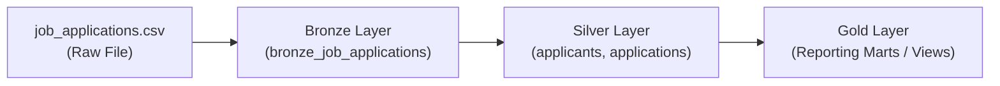

# Data Pipeline

The data pipeline implementation structured according to the Medallion Architecture pattern: 
   - **Bronze** (raw ingestion)
   - **Silver** (cleaned and normalized), 
   - **Gold** (aggregated analytical views).

---

## Architecture Overview

